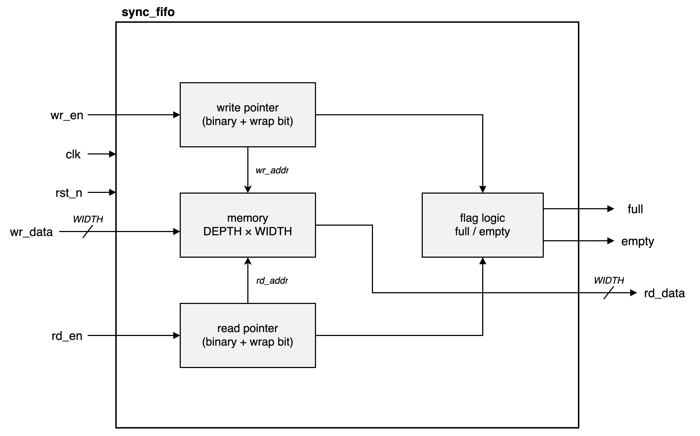
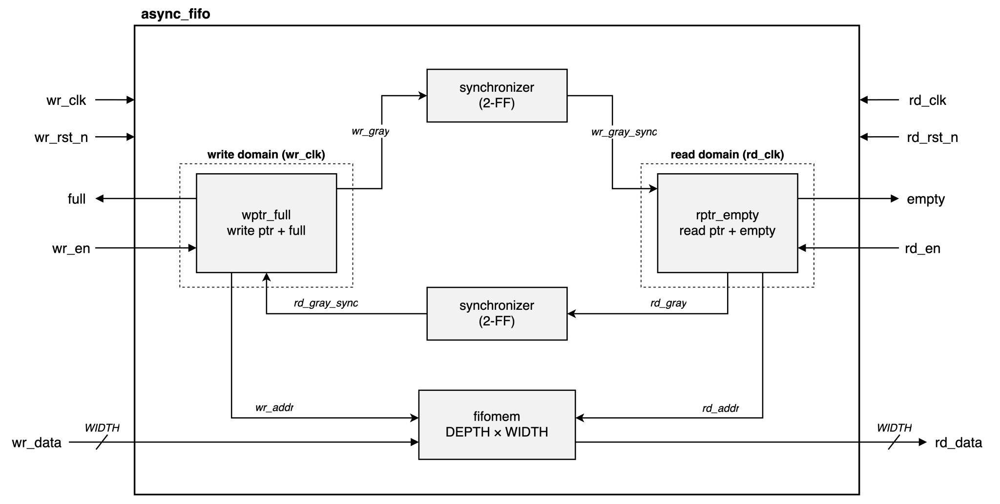
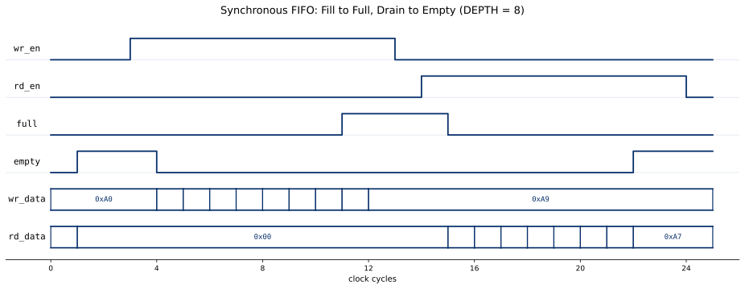
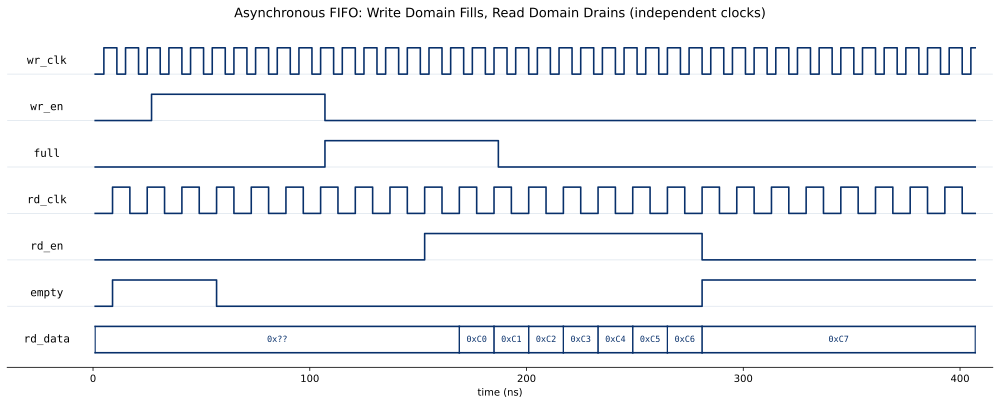

# fifo

[](https://github.com/drewbabel/fifo/actions/workflows/ci.yml)

A configurable synchronous and asynchronous FIFO written in SystemVerilog.

The synchronous FIFO uses binary pointers with a wrap bit for full/empty detection in a single clock domain. The asynchronous FIFO crosses two independent clock domains by Gray-coding its pointers and passing them through two-flop synchronizers, ensuring metastability-safe arbitration between reader and writer.

Both implementations store data in a dual-port memory with separate read and write ports. A separate `synchronizer` module guards the Gray-coded pointers against metastability, and `wptr_full` and `rptr_empty` modules manage pointer state and flag logic in their respective domains.

Every module has a self-checking testbench, and the asynchronous FIFO carries a full unbounded SymbiYosys proof that certifies pointer ordering and occupancy bounds across all clock edges.





## Parameters

| Parameter | Default | Description |
|-----------|---------|-------------|
| `WIDTH` | `8` | Bit width of each data entry |
| `DEPTH` | `16` | Number of entries the FIFO can hold |

## Interface

### `sync_fifo`

| Signal | Direction | Width | Description |
|--------|-----------|-------|-------------|
| `clk` | in | 1 | System clock |
| `rst_n` | in | 1 | Synchronous active-low reset |
| `wr_en` | in | 1 | Write enable |
| `rd_en` | in | 1 | Read enable |
| `wr_data` | in | `WIDTH` | Data to write |
| `rd_data` | out | `WIDTH` | Data read |
| `full` | out | 1 | FIFO is full (cannot write) |
| `empty` | out | 1 | FIFO is empty (cannot read) |

### `async_fifo`

| Signal | Direction | Width | Description |
|--------|-----------|-------|-------------|
| `wr_clk` | in | 1 | Write-domain clock |
| `wr_rst_n` | in | 1 | Write-domain synchronous active-low reset |
| `wr_en` | in | 1 | Write enable |
| `wr_data` | in | `WIDTH` | Data to write |
| `full` | out | 1 | FIFO is full in write domain (cannot write) |
| `rd_clk` | in | 1 | Read-domain clock |
| `rd_rst_n` | in | 1 | Read-domain synchronous active-low reset |
| `rd_en` | in | 1 | Read enable |
| `rd_data` | out | `WIDTH` | Data read |
| `empty` | out | 1 | FIFO is empty in read domain (cannot read) |

## Verification

| Module | Method |
|--------|--------|
| `synchronizer` | Self-checking testbench |
| `sync_fifo` | Self-checking testbench |
| `async_fifo` | Self-checking testbench + SymbiYosys proofs |

The `fifomem`, `wptr_full`, and `rptr_empty` submodules are exercised through the `async_fifo` testbench and covered by its formal proof.

Properties proven in formal:
- Occupancy never exceeds `DEPTH`
- `empty` is asserted when occupancy equals zero
- `full` is asserted when occupancy equals `DEPTH`
- Gray-coded pointers maintain correct ring ordering across all write/read clock patterns
- Write pointer is never passed by read pointer and vice versa
- Proven over unbounded k-induction for all possible inputs and clock patterns

## Results





## Building and running

Every module builds from the top-level Makefile.

```
make MOD=sync_fifo                                  # run a module's testbench
make wave MOD=sync_fifo                             # run the testbench and open the waveform in Surfer
make formal MOD=async_fifo                          # run the module's SymbiYosys proof
./synth_stats.sh sync_fifo                          # report a module's synthesis cost
./fmax.sh async_fifo tt_async_fifo wr_clk rd_clk    # fmax and utilization
```

## Synthesis

Synthesized for the Digilent Basys 3 (Xilinx Artix-7).

| Module | LUTs | Flip-flops | Carry cells |
|--------|------|------------|-------------|
| `synchronizer` | 0 | 2 | 0 |
| `fifomem` | 2 | 8 | 0 |
| `wptr_full` | 9 | 9 | 2 |
| `rptr_empty` | 9 | 9 | 2 |
| `sync_fifo` | 8 | 18 | 4 |
| `async_fifo` | 19 | 46 | 4 |

### Post-route timing

`fmax.sh` places and routes each FIFO in a registered-boundary harness and reports the maximum clock frequency. This data relies on the experimental nextpnr-xilinx open-source toolchain, meaning frequencies are unverified and lack vendor-signed timing analysis. The `async_fifo` carries one frequency per clock domain, since a single figure has no meaning across the two independent clocks. The memory maps to distributed RAM rather than block RAM at this depth.

| Module | LUTs | Flip-flops | Block RAMs | Distributed RAM | Fmax |
|--------|------|------------|------------|-----------------|------|
| `sync_fifo` | 8 | 18 | 0 | 2 | 324 MHz |
| `async_fifo` | 19 | 46 | 0 | 2 | 296 MHz write, 343 MHz read |

### Tool versions

Icarus Verilog 13.0, Yosys 0.66, SymbiYosys 0.66 with Z3, nextpnr-xilinx 0.8.2, and Surfer.
