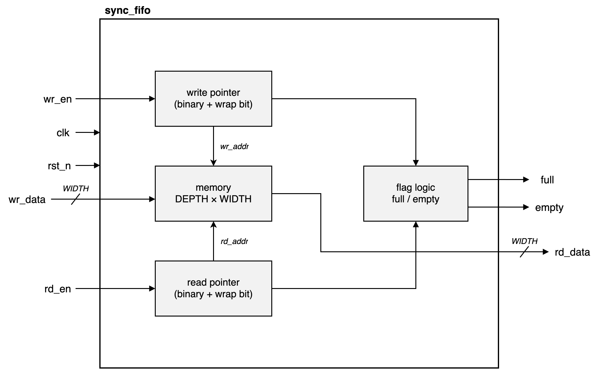
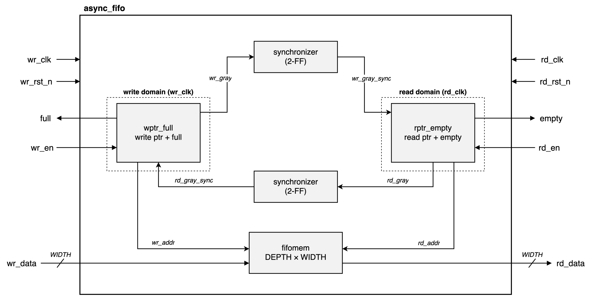

# fifo

[](https://github.com/drewbabel/fifo/actions/workflows/ci.yml)

A configurable synchronous and asynchronous FIFO in SystemVerilog, with:

- Binary pointers with a wrap bit for full and empty detection in a single clock domain.
- Gray-coded pointers through two-flop synchronizers to cross two independent clock domains.
- A dual-port memory with separate read and write ports, mapping to distributed RAM at this depth.
- `wptr_full` and `rptr_empty` managing pointer state and flag logic in their own domains.





## Verification

| Module | Method |
|--------|--------|
| `synchronizer` | Self-checking testbench |
| `sync_fifo` | Self-checking testbench |
| `async_fifo` | Self-checking testbench + SymbiYosys proofs |

`fifomem`, `wptr_full`, and `rptr_empty` are exercised through the `async_fifo` testbench and covered by its proof.

The asynchronous proof runs unbounded k-induction over every input and clock pattern. It establishes that occupancy never exceeds `DEPTH`, that `empty` and `full` assert exactly at zero and `DEPTH`, that the Gray-coded pointers hold their ring ordering, and that neither pointer ever passes the other.

## Implementation

Utilization comes from AMD Vivado 2026.1 out-of-context synthesis for the Xilinx Artix-7 XC7A35T, and the frequencies come from Vivado place-and-route of the `fmax/` harnesses.

| Module | Logic LUTs | LUTRAM | Flip-flops | Fmax |
|--------|------|------------|-----------------|------|
| `synchronizer` | 1 | 0 | 2 | |
| `fifomem` | 2 | 8 | 8 | |
| `sync_fifo` | 14 | 8 | 18 | 346.1 MHz |
| `wptr_full` | 10 | 0 | 9 | |
| `rptr_empty` | 10 | 0 | 9 | |
| `async_fifo` | 20 | 8 | 46 | 375.8 MHz write, 409.2 MHz read |

`fmax.sh` places and routes each FIFO in a registered-boundary harness, and `vivado/fmax.tcl` drives the same harnesses to reproduce the frequencies above, with the two clock domains declared asynchronous. `async_fifo` carries one frequency per clock domain, since a single figure has no meaning across two independent clocks.

## Building and running

```
make MOD=sync_fifo                                  # run a module's testbench
make wave MOD=sync_fifo                             # run the testbench and open the waveform in Surfer
make formal MOD=async_fifo                          # run the module's SymbiYosys proof
make trace MOD=async_fifo                           # print a formal counterexample as text
make view-formal MOD=async_fifo                     # open a formal waveform in Surfer
./fmax.sh async_fifo tt_async_fifo wr_clk rd_clk    # fmax and utilization
```

### Tool versions

Icarus Verilog 13.0, Yosys 0.66, SymbiYosys 0.66 with Z3, nextpnr-xilinx 0.8.2, and Surfer.
